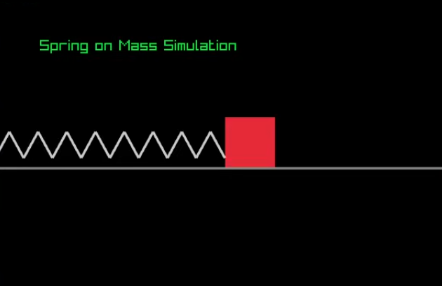

# Builderz > Simulation-Of-Physics-Phenomena-CPP (Project 1.1)

  

Physics phenomena applied on simple 2D shapes.

**Features:**
- Uses `raylib` library

**Setup raylib:**
- Windows:(video)-https://youtu.be/PaAcVk5jUd8?si=6szJCgaJYHdc8Y50
- linux-read the raylib documentation.

**Contribute**

Want to add more? Fork this repo, add your simulation.cpp and  submit a PR.

**Join Builderz?**
 
Telegram : https://t.me/+20bm-nYA7Fc5ODA0
